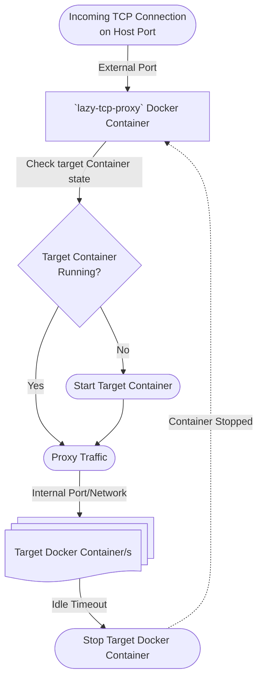

# lazy-tcp-proxy

# Overview

## What:

**On-demand TCP proxy for Docker containers.**

## Introduction:

`lazy-tcp-proxy` allows you to run many Dockerized services on a single host, but only start containers when a connection arrives. It stops containers after a configurable idle timeout, saving resources while providing seamless access.


### Why:

To save compute resources (CPU, RAM) on a single host by keeping containers stopped until they're actually needed, making it practical to run many low-traffic services without paying the cost of having them all running simultaneously.

### Feedback:

> "Finally, scale to zero!" - Nick G.

> "This is something that should really be built into Docker!" - Tom H.

---

## Feature Request

This should be core functionality in the docker engine. As such, I've raised a Feature Request to add this behaviour - https://github.com/docker/roadmap/issues/899

---

## Questions and Answers

[Can be found here.](QANDA.md)

---

## Quick Start

```sh
docker run -d \
	-v /var/run/docker.sock:/var/run/docker.sock \
    -e IDLE_TIMEOUT_SECS=30 \
    -e POLL_INTERVAL_SECS=5 \
	-p "9000-9099:9000-9099" \
    --restart=always \
    --name lazy-tcp-proxy \
	mountainpass/lazy-tcp-proxy
```

Then add labels to new or existing containers (see below).

Or start with the example project - [`example/docker-compose.yml`](example/docker-compose.yml).

---

## Container Label Configuration

Add these labels to any container you want proxied/managed:

| Label | Required | Description |
|-------|----------|-------------|
| `lazy-tcp-proxy.enabled` | Yes | Must be `true` to opt the container in |
| `lazy-tcp-proxy.ports` | Yes | Comma-separated `<listen>:<target>` port pairs |
| `lazy-tcp-proxy.allow-list` | No | Comma-separated IPs/CIDRs. If set, only matching source addresses are forwarded; all others are silently dropped |
| `lazy-tcp-proxy.block-list` | No | Comma-separated IPs/CIDRs. If set, matching source addresses are silently dropped; all others are forwarded |

Both `allow-list` and `block-list` accept plain IP addresses (e.g. `127.0.0.1`, `::1`) and CIDR ranges (e.g. `192.168.0.0/16`, `fd00::/8`). If both labels are set, the allow-list is evaluated first. Blocked connections are logged with a red `(blocked)` suffix and do **not** wake the container.

Example:

```yaml
labels:
  - "lazy-tcp-proxy.enabled=true"
  - "lazy-tcp-proxy.ports=9000:80,9001:8080"
  - "lazy-tcp-proxy.allow-list=192.168.0.0/16,127.0.0.1"
  - "lazy-tcp-proxy.block-list=172.29.0.3,155.248.209.22"
```

---

## Environment Variables

| Variable            | Description                                                        | Default                   |
|---------------------|--------------------------------------------------------------------|---------------------------|
| `IDLE_TIMEOUT_SECS` | How long (in seconds) a container must be idle before being stopped| 120                       |
| `POLL_INTERVAL_SECS`| How often (in seconds) to check for idle containers                | 15                        |
| `DOCKER_SOCK`       | Path to Docker socket                                              | `/var/run/docker.sock`    |

All are optional; defaults are safe for most setups.

---

## Features

- **Automatic TCP proxying:** Listens on host ports and proxies to containers, starting them on demand.
- **Label-based configuration:** Opt-in containers using Docker labels—no static config files.
- **Multi-port support:** Proxy multiple ports per container using `lazy-tcp-proxy.ports` label.
- **Idle shutdown:** Containers are stopped after a configurable period of inactivity.
- **Dynamic discovery:** Watches Docker events for new/removed containers and updates proxy targets live.
- **Network auto-join:** Proxy joins Docker networks as needed to reach containers by internal IP.
- **Graceful shutdown:** Leaves all joined networks on SIGINT/SIGTERM.
- **Per-service IP filtering:** Optional allow-list and block-list per container via labels; supports plain IPs and CIDRs.
- **Structured, colorized logs:** Container names in yellow, network names in green, source addresses in cyan for easy scanning.

---

## Architecture



**How it works:**
- The proxy listens on host ports and intercepts incoming TCP connections.
- When a connection arrives, it checks if the target container is running (based on label configuration).
- If not running, it starts the container on demand.
- Proxies the connection to the container's internal port.
- If the container is idle for the configured timeout, it is stopped to save resources.

---

## Building and Publishing

```sh
cd lazy-tcp-proxy
VERSION=1.`date +%Y%m%d`.`git rev-parse --short=8 HEAD`
docker buildx build \
  --platform linux/amd64,linux/arm64/v8 \
  --tag mountainpass/lazy-tcp-proxy:${VERSION} \
  --tag mountainpass/lazy-tcp-proxy:latest \
  --push \
  .
```

---

## Required resources

The container is designed to run with an extremely low footprint.

```shell
CONTAINER ID   NAME               CPU %     MEM USAGE / LIMIT     MEM %     NET I/O           BLOCK I/O         PIDS
cbc5f775a793   lazy-tcp-proxy     0.00%     4.238MiB / 19.52GiB   0.02%     1.51MB / 1.4MB    0B / 0B           13
```

---

## Logging

- **Container names** are shown in yellow: `\033[33m<name>\033[0m`
- **Network names** are shown in green: `\033[32m<name>\033[0m`
- All key events (startup, discovery, container start/stop, network join/leave, proxy activity) are logged with clear, structured messages.
- Rejection reasons for misconfigured containers are logged on every start event.

---

## Requirements-First Development Workflow

All changes are tracked as requirements in the `requirements/` directory. See [AGENTS.md](AGENTS.md) for the full workflow. Every feature, fix, or change is documented and reviewed before implementation.

---

## Building & Development

- Written in Go, using the official Docker Go SDK.
- Minimal Docker image (`FROM scratch`).
- See requirements/ for detailed design and implementation notes.

---

## License

MIT